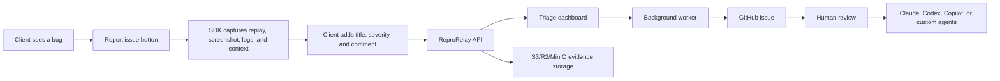
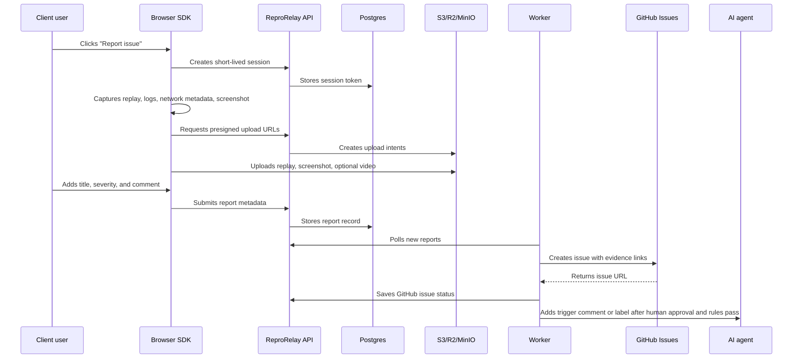
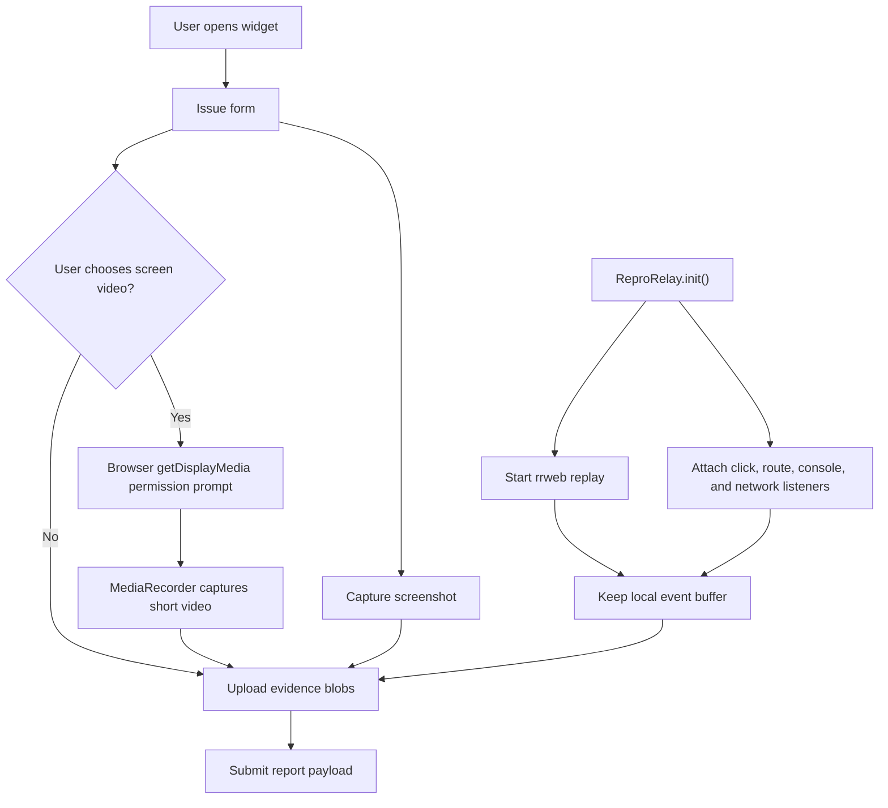
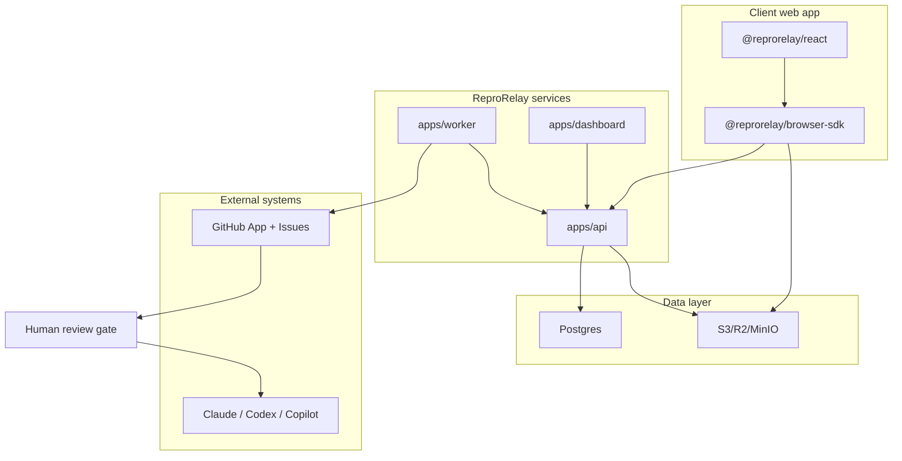
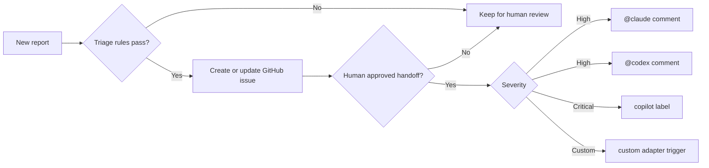
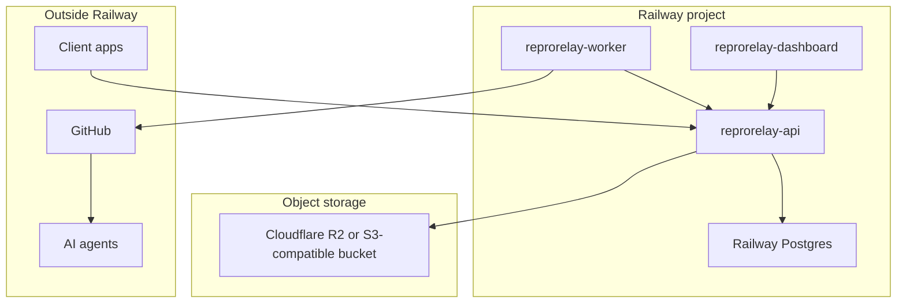

# ReproRelay

ReproRelay is an open-source client bug capture system for web apps. Drop a small SDK into a client project, show a floating **Report issue** button, and let the client submit a useful bug report without writing a long email.

The report can include a DOM replay, screenshot, optional user-approved screen recording, click timeline, console errors, network metadata, browser context, and the client's comment. ReproRelay then sends the report to a dashboard, creates a GitHub issue, generates an AI triage draft, and can hand the issue to AI coding agents only after human review approves it.

V1 is web-first and MIT licensed.

## What It Does



ReproRelay is designed for agencies, freelancers, internal product teams, and support-heavy software teams that want bug reports with enough context to act on immediately.

## Why This Exists

Most client bug reports arrive as:

- "It does not work."
- A cropped screenshot with no URL.
- A Loom video with no console output.
- An email thread that never becomes an actionable issue.

ReproRelay turns that into:

- What the user clicked.
- What route they were on.
- What the browser console saw.
- What network requests failed.
- What the page looked like.
- What release and environment were running.
- A GitHub issue with an agent-ready prompt.

## Feature Map

| Area | V1 support |
| --- | --- |
| Web embed | Browser SDK and React helper package |
| User entry point | Floating report button or manual `ReproRelay.show()` |
| Replay | rrweb DOM/session replay |
| Screenshot | `html2canvas` capture during submit |
| Video | Optional `getDisplayMedia` screen recording after browser permission |
| Logs | Console events and fetch metadata |
| Context | URL, title, viewport, user agent, release, environment, user, custom context |
| Privacy | Input masking, token/cookie redaction, query-value redaction, mask/ignore attributes |
| Backend | Fastify API, Postgres store, S3-compatible object storage |
| Dashboard | React/Vite triage UI |
| Projects | Add projects from the dashboard (Workspace settings → Projects): generated key, embed snippet, per-project CORS origin, and an inbox project switcher |
| Team | Per-person dashboard logins (Workspace settings → Team) with scrypt-hashed passwords and note/review attribution; the shared admin password stays as bootstrap |
| GitHub | GitHub App issue creation and webhook verification |
| AI triage | Draft summary, likely area, severity recommendation, labels, tests, and agent prompt |
| AI handoff | Claude, Codex, Copilot, and custom trigger adapters after human approval |
| Deployment | Docker Compose, Railway, Vercel-first, and generic container hosting |
| Evidence storage | Local dev, S3-compatible storage, or Vercel Blob |

## How A Report Moves Through The System



## Capture Pipeline



Browsers do not allow invisible screen recording. ReproRelay can record DOM replay immediately, but true screen video always requires a user gesture and a browser permission prompt.

## What Gets Collected

| Data | Default | Notes |
| --- | --- | --- |
| DOM replay events | Yes | Powered by rrweb with masking defaults |
| Screenshot | Yes | Captured when the report is submitted |
| Screen video | No | Optional and permission-gated |
| Click timeline | Yes | Records useful click descriptions, not raw passwords |
| Route changes | Yes | Helps reproduce navigation bugs |
| Console logs/errors | Yes | Useful for stack traces and runtime failures |
| Network metadata | Yes | URL, method, status, duration, selected safe headers |
| Request/response bodies | No | Avoids accidental sensitive data capture |
| Cookies/tokens/passwords | Redacted | Redacted by default |
| Custom app context | Optional | Add account ID, plan, feature flags, tenant, etc. |

## Architecture



## Quick Start

Requirements:

- Node.js 24.x
- npm 10+
- Docker, if you want the full local stack

Install and verify:

```bash
npm ci
npm run check
```

Run the full local stack:

```bash
cp .env.example .env
docker compose up
```

Run apps locally without Docker:

```bash
npm run dev:api
npm run dev:dashboard
npm run dev:showcase
npm run dev:demo
```

Default local URLs:

| App | URL |
| --- | --- |
| API | `http://localhost:4000` |
| Live dashboard | `http://localhost:5173` |
| Showcase dashboard | `http://localhost:5174` |
| Demo client app | Vite-assigned demo URL |
| MinIO | `http://localhost:9000` |
| Postgres | `localhost:5432` |

The two dashboard commands are deliberately separate:

- `npm run dev:dashboard` is the API-backed dashboard used for real deployments. It never imports showcase fixtures and shows an honest empty or error state when no live reports are available.
- `npm run dev:showcase` is the visual showcase with sample reports, people, evidence, and activity. Its assets are compiled into `apps/dashboard/dist-showcase`, not the deployable `apps/dashboard/dist` bundle.

The normal `npm run build` and dashboard Dockerfile always build the live dashboard. The live build also runs a guard that fails if known showcase reports, identities, or assets appear in the production bundle.

## Embed In A Web App

### Browser SDK

```ts
import { ReproRelay } from "@reprorelay/browser-sdk";

ReproRelay.init({
  projectKey: "proj_client_app",
  apiUrl: "https://reprorelay.example.com",
  release: "1.4.2",
  environment: "production",
  user: {
    id: "user_123",
    email: "client@example.com",
    name: "Client User",
  },
  context: {
    accountId: "acct_123",
    plan: "enterprise",
  },
  widget: {
    position: "right-center",
    enableScreenRecording: true,
    enableCameraRecording: true,
    enableMicrophone: true,
    maxRecordingMs: 90000,
  },
});
```

The injected side launcher uses the ReproRelay logo and opens an isolated Shadow DOM widget. Users can submit a normal report, record their screen with voice, or record screen + webcam + voice while they reproduce the problem. Recording only starts after explicit browser permission and stops automatically after 90 seconds by default.

### Plain HTML / Any Web Framework

The standalone build exposes the same SDK without requiring React, Vue, or a bundler:

```html
<script src="https://cdn.jsdelivr.net/npm/@reprorelay/browser-sdk@0.6.0/dist/reprorelay.iife.js"></script>
<script>
  ReproRelay.init({
    projectKey: "proj_client_app",
    apiUrl: "https://reprorelay.example.com",
  });
</script>
```

### React

```tsx
import { ReproRelayProvider } from "@reprorelay/react";

export function App() {
  return (
    <ReproRelayProvider
      config={{
        projectKey: "proj_client_app",
        apiUrl: "https://reprorelay.example.com",
        release: "1.4.2",
      }}
    >
      <YourApp />
    </ReproRelayProvider>
  );
}
```

### Manual Controls

```ts
ReproRelay.show();
ReproRelay.report({ title: "Checkout failed", comment: "Card form froze." });
ReproRelay.setUser({ id: "user_123", email: "client@example.com" });
ReproRelay.setContext({ accountId: "acct_123", featureFlag: "new-checkout" });
ReproRelay.addBreadcrumb({ type: "custom", message: "User opened billing drawer" });
```

## Privacy Controls

ReproRelay starts conservative because this is meant to be embedded inside real client projects.

```html
<input data-reprorelay-mask value="sensitive value" />
<section data-reprorelay-ignore>Never capture this DOM subtree</section>
```

Default privacy behavior:

- Mask text-like inputs.
- Always mask passwords.
- Redact cookies, tokens, authorization headers, and session-like values.
- Redact query string values by default.
- Capture network metadata, not request or response bodies.
- Let host apps add custom mask and ignore selectors.

Read more in [docs/privacy-security.md](docs/privacy-security.md).

## GitHub And Agent Handoff

The worker creates GitHub issues with an evidence-rich body:

- Client comment
- Reproduction timeline
- Replay, screenshot, and video links
- Browser, viewport, URL, release, environment
- Console summary
- Network summary
- Agent prompt section

Agent handoff is human-reviewed by default. The worker can generate the AI triage draft automatically, but it only adds agent triggers after a human approves handoff and configured rules pass.



See [docs/github-app.md](docs/github-app.md) and [docs/agents.md](docs/agents.md).

## Hosting

ReproRelay is intentionally host-agnostic. The app is split into API, worker, dashboard, Postgres metadata, and object storage, so people can choose the hosting shape that fits their stack.

| Path | Good default |
| --- | --- |
| Docker/self-host | Postgres + MinIO |
| Railway | Railway Postgres + R2/S3/Vercel Blob |
| Vercel-first | Neon/Supabase Postgres + Vercel Blob |
| Generic containers | Managed Postgres + S3-compatible storage |

See [docs/hosting.md](docs/hosting.md) and [docs/storage-providers.md](docs/storage-providers.md).

For the Gleap benchmark and prioritized product sequence, see [docs/gleap-inspired-roadmap.md](docs/gleap-inspired-roadmap.md).

## Railway Deployment

Railway remains a supported production target. The repo includes three service configs:

| Service | Config |
| --- | --- |
| API | `railway/api.railway.json` |
| Worker | `railway/worker.railway.json` |
| Dashboard | `railway/dashboard.railway.json` |



Full instructions are in [docs/railway.md](docs/railway.md).

## Repository Layout

```text
reprorelay/
  apps/
    api/          Fastify API for sessions, uploads, reports, assets, webhooks
    dashboard/    React/Vite triage dashboard
    worker/       GitHub issue sync and agent handoff worker
  packages/
    browser-sdk/  Client capture widget and upload flow
    react/        React provider and report button
    shared/       Schemas, redaction, issue body formatting, fixtures
    github/       GitHub App client helpers and webhook verification
    agent-adapters/
                  Claude, Codex, Copilot, and custom trigger logic
  examples/
    react-demo/   Demo client app using the SDK
  docs/           Architecture, embed, privacy, GitHub, agents, Railway
  railway/        Railway service config files
```

## Useful Commands

```bash
npm run check           # lint, typecheck, test, build
npm run dev:api         # API dev server
npm run dev:dashboard   # live API-backed dashboard on :5173
npm run dev:showcase    # fixture-backed showcase dashboard on :5174
npm run dev:demo        # demo client app
npm run build           # build packages and apps
npm run build:showcase  # build the separate showcase bundle
npm audit               # dependency audit
```

## Configuration

Common environment variables:

| Variable | Used by | Purpose |
| --- | --- | --- |
| `REPRORELAY_API_URL` | API, worker, clients | Public API origin |
| `REPRORELAY_PUBLIC_URL` | Worker | Dashboard/public URL for issue links |
| `DATABASE_URL` | API | Postgres connection string |
| `CORS_ORIGINS` | API | Comma-separated allowed browser origins |
| `REPRORELAY_PROJECT_KEYS` | API | Optional comma-separated project allowlist; keys are seeded into the projects table on startup. Projects added from the dashboard (Workspace settings → Projects) are accepted too, so this is only needed for env-managed setups |
| `REPRORELAY_STATUS_API_KEYS` | API | Optional JSON object mapping project keys to server-only secrets for authenticated, cross-browser organisation status feeds |
| `REPRORELAY_MAX_UPLOAD_BYTES` | API | Maximum evidence upload size; defaults to 25 MiB |
| `S3_ENDPOINT` | API | S3/R2/MinIO endpoint |
| `S3_BUCKET` | API | Evidence bucket |
| `S3_ACCESS_KEY_ID` | API | Object storage access key |
| `S3_SECRET_ACCESS_KEY` | API | Object storage secret |
| `S3_PUBLIC_URL` | API | Optional direct public asset base URL |
| `STORAGE_DRIVER` | API | `auto`, `local`, `s3`, or `vercel-blob` |
| `VERCEL_BLOB_ACCESS` | API | `private` or `public` for Vercel Blob |
| `BLOB_READ_WRITE_TOKEN` | API | Vercel Blob read-write token outside Vercel OIDC |
| `BLOB_STORE_ID` | API | Vercel Blob store ID for Vercel OIDC |
| `VERCEL_BLOB_MAX_UPLOAD_BYTES` | API | Vercel Blob upload size cap |
| `CRON_SECRET` | API | Secret Vercel Cron sends to the daily evidence-retention route |
| `REPRORELAY_VIDEO_RETENTION_DAYS` | API | Days to retain video evidence; defaults to `7` |
| `WEBHOOK_SECRET` | API | GitHub webhook signature secret |
| `GITHUB_APP_ID` | Worker | GitHub App ID |
| `GITHUB_PRIVATE_KEY_BASE64` | Worker | Base64 encoded GitHub App private key |
| `GITHUB_INSTALLATION_ID` | Worker | Installation ID for the target repo |
| `GITHUB_OWNER` | Worker | GitHub owner or org |
| `GITHUB_REPO` | Worker | GitHub repo name |
| `AGENT_HANDOFF_MODE` | Worker | `triage` or `manual` |

See [.env.example](.env.example) for the complete local template.

## Current Status

This repo is an early V1 foundation. The core monorepo, SDK, API, dashboard, worker, GitHub issue formatting, agent adapters, Docker Compose, and Railway deployment files are in place.

ReproRelay does not provide a shared hosted backend. Self-hosters supply their own database, evidence storage, GitHub App credentials, and optional email or AI-provider credentials. The included Vercel, Railway, Docker, S3-compatible, and local adapters are generic deployment options and are not connected to the maintainers' infrastructure.

Good next issues:

- Add authenticated organizations, dashboard users, project membership, and private asset reads.
- Add an embedded replay viewer and screenshot annotation UI.
- Add assignees, teams, tags, comments, filters, saved views, and duplicate groups.
- Add XHR, global error, unhandled rejection, rage-click, retry, and offline capture.
- Make GitHub sync bidirectional, then add the connector contract for Linear and Jira.
- Add a persistent queue backend and browser-matrix end-to-end tests.

## License

MIT. ReproRelay intentionally avoids AGPL forks so it can be embedded into commercial client work without license surprises.
