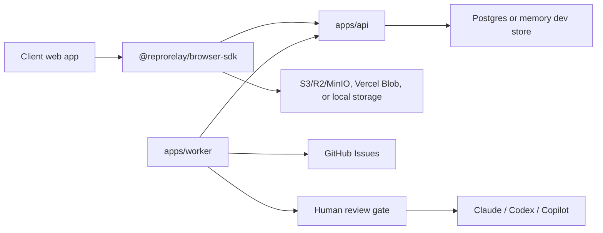

# Architecture

ReproRelay has four moving parts:

1. Client apps embed `@reprorelay/browser-sdk` or `@reprorelay/react`.
2. The API creates short-lived sessions, upload intents, and report records.
3. Object storage receives screenshots, replay event blobs, and optional videos.
4. The worker creates AI triage drafts, opens GitHub issues, and waits for human approval before AI agent handoff.

## Capture Defaults

- Session replay: rrweb
- Screenshot: html2canvas
- Screen video: optional `getDisplayMedia` and `MediaRecorder`
- Events: clicks, routes, console, and fetch metadata
- Privacy: text inputs masked, cookies/tokens redacted, query strings redacted

Browsers do not allow invisible screen recording. The SDK only requests video when the user checks the video option and accepts the browser permission prompt.

## Storage

Production should use S3-compatible storage or Vercel Blob. Local development falls back to `storage/` and upload URLs under `/v1/local-uploads`.

## Processing

The API accepts reports immediately. The worker periodically:

- Finds new or triaged reports
- Generates an AI triage draft when missing
- Creates a GitHub issue with linked evidence
- Applies labels such as `reprorelay`, `severity:high`, and `env:staging`
- Sends agent trigger comments or labels only after human approval and triage rules pass
