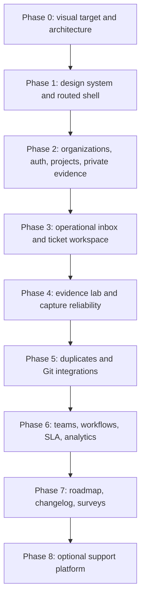

# ReproRelay Gleap-Inspired Implementation Plan

Status: proposed

Prepared: 2026-07-10

Companion research: [Gleap-inspired product roadmap](gleap-inspired-roadmap.md)

## Goal

Turn ReproRelay from a credible V1 capture pipeline into a polished, self-hosted customer issue platform that can compete with the most valuable parts of Gleap:

- evidence-rich issue capture;
- fast team triage and collaboration;
- reliable Git and agent handoff;
- customer follow-up and feedback loops;
- a dashboard that looks and behaves like a finished developer product.

The objective is not full Gleap parity. The objective is to own the open-source, evidence-to-fix workflow first, then expand into adjacent feedback and support workflows without weakening privacy, maintainability, or self-hosting.

## Product Thesis

> ReproRelay is the self-hosted issue intelligence workspace connecting reporters, support teams, maintainers, Git repositories, and coding agents through one traceable evidence trail.

The product must feel coherent even while the feature set grows. Every report, duplicate occurrence, internal note, customer reply, GitHub issue, pull request, release, and reporter notification should remain connected to the same underlying problem record.

## Current Baseline

The repository already has the correct technical spine:

- browser and React SDKs;
- screenshot, DOM replay, optional screen recording, console, fetch, route, and click capture;
- privacy redaction controls;
- Fastify API, Postgres or memory store, and object storage;
- React/Vite dashboard;
- GitHub issue creation;
- deterministic AI triage with an explicit human approval gate;
- agent handoff adapters.

The current dashboard is still an early implementation:

- `App.tsx` owns fetching, filtering, selection, and mutation without routing or a server-state layer;
- the sidebar is a set of static buttons rather than real navigation;
- all styling lives in one global CSS file with literal values rather than reusable design tokens;
- the fixed report-table and 430px detail split does not scale to richer ticket work;
- replay opens as a raw asset instead of an embedded evidence experience;
- loading, failure, offline, authorization, and true empty states are missing;
- the API client silently falls back to demo data on any fetch failure, which can hide production problems;
- report operations are stored inside a JSON payload and the API creates tables at runtime rather than using migrations;
- authenticated users, organizations, projects, roles, private evidence reads, comments, assignments, tags, duplicates, and workflows do not yet exist.

The ingestion hardening work already in the current working tree is the starting point, not the end of the security phase.

## Success Measures

The first competitive release is successful when:

- a new self-hosted admin can install the stack and create a first project in under 15 minutes;
- a reporter can submit a useful issue in under 60 seconds;
- an operator can understand and route a normal report in under 90 seconds;
- replay, screenshot, console, network, metadata, and activity are inspectable without leaving the ticket;
- every dashboard and evidence request is organization- and project-scoped;
- duplicate reports accumulate as occurrences instead of flooding the inbox;
- GitHub state and ReproRelay state remain synchronized and idempotent;
- keyboard-only operators can complete the core triage path;
- all primary screens meet WCAG 2.2 AA contrast and focus requirements;
- desktop, tablet, and mobile layouts have intentional workflows rather than merely stacked desktop panels;
- no coding-agent write occurs without the configured approval policy.

## Product And Design Principles

1. **Evidence first.** The screenshot or replay is the center of the ticket experience, not an attachment buried below metadata.
2. **Dense but calm.** This is an operations tool. It should show substantial information without looking noisy or cramped.
3. **One obvious next action.** Every state should make the next useful action clear: assign, reproduce, merge, reply, sync, approve, or close.
4. **Progressive disclosure.** Surface the title, state, severity, owner, reporter, and strongest evidence first; keep raw logs and advanced metadata available without dominating the screen.
5. **AI is assistive and attributable.** AI summaries and recommendations show their evidence, confidence, model/provider, and approval state.
6. **Self-hosted is visible.** Health, storage, worker, integration, and version status should be understandable from the UI.
7. **Accessible by default.** Color never carries meaning alone; focus, keyboard behavior, reduced motion, and screen-reader labels ship with components.
8. **No fake success.** Demo data is an explicit mode. Network errors, missing permissions, empty projects, and unavailable evidence must be distinguishable.

## Major UI Overhaul

### Visual Direction Gate

Before production UI implementation, create three high-fidelity directions using the real report fixtures and current flows:

1. **Command Center — recommended:** compact technical workspace, strong evidence canvas, warm neutral surfaces, restrained orange actions, crisp status colors.
2. **Evidence Lab:** darker evidence-focused workspace with console/network density and stronger developer-tool character.
3. **Customer Operations:** brighter, more conversational inbox that gives reporter history and collaboration more visual weight.

The selected direction must include:

- desktop inbox and open-ticket states;
- replay or screenshot evidence state;
- empty, loading, error, and permission states;
- mobile inbox and mobile ticket states;
- light and dark theme tokens;
- a component-state sheet covering buttons, inputs, menus, tabs, badges, tables, dialogs, toasts, command palette, and focus behavior.

Do not start the visual rewrite until one direction is selected. This prevents a large component migration from locking in an arbitrary style.

### Recommended Design Language

Unless the visual checkpoint changes it, use the following product character:

- keep Inter and Lucide;
- retain orange as the brand/action accent, but reduce its use to selected navigation, primary actions, timeline markers, and key evidence moments;
- use warm-neutral backgrounds, near-black text, quiet borders, and subtle elevation;
- use semantic colors for severity, status, sync health, privacy, and SLA without relying on color alone;
- adopt an 8px spacing rhythm with compact 32–36px operator controls and larger touch targets on mobile;
- use 10–14px radii, restrained shadows, and 120–180ms transitions;
- avoid gradients, glass effects, oversized cards, novelty AI styling, and decorative dashboard charts that do not help triage;
- support light, dark, and system themes from the same semantic token set.

### Target Information Architecture

Primary authenticated routes:

| Route | Purpose |
| --- | --- |
| `/login` | Sign in, first-admin bootstrap, and OIDC entry |
| `/app/:org/:project/inbox` | Saved views and report queue |
| `/app/:org/:project/reports/:reportId` | Deep-linked ticket workspace |
| `/app/:org/:project/contacts` | Reporter and account history |
| `/app/:org/:project/workflows` | Routing, SLA, and automation rules |
| `/app/:org/:project/integrations` | GitHub and connector configuration |
| `/app/:org/:project/roadmap` | Feature requests and internal roadmap |
| `/app/:org/:project/analytics` | Queue, quality, resolution, and agent outcomes |
| `/app/:org/:project/settings/*` | Project, SDK, privacy, retention, members, and API keys |
| `/roadmap/:projectSlug` | Public feature-request roadmap |
| `/reply/:token` | Secure customer reply and status page |

### Application Shell

Replace the static sidebar/topbar with:

- collapsible primary navigation;
- organization and project switcher;
- saved-view counts and urgent/SLA indicators;
- global command palette and search;
- create/report actions where appropriate;
- worker, storage, integration, and SDK health surfaced through a status center;
- user menu, theme selection, and keyboard shortcut reference;
- responsive mobile navigation using a bottom bar or sheet, not a hidden desktop sidebar.

### Inbox And Ticket Workspace

Desktop should use a flexible three-region workspace:

- **queue:** virtualized report list with saved views, grouping, filters, bulk selection, density control, and keyboard navigation;
- **ticket canvas:** title, reporter message, conversation, evidence, AI summary, and activity;
- **inspector:** status, priority, team, assignee, tags, SLA, release, environment, integration state, duplicate group, and custom fields.

The ticket canvas should use stable tabs:

- Conversation;
- Evidence;
- Activity.

The Evidence tab should contain:

- screenshot, replay, and video modes;
- annotated screenshot tools;
- embedded rrweb playback;
- a synchronized event timeline;
- filterable console and network entries;
- browser, route, release, environment, viewport, flags, and custom context;
- clear privacy/masking indicators;
- download or share controls governed by permissions.

On tablet and mobile, the queue and ticket become separate routes with preserved filters and scroll position. The inspector becomes a sheet. Evidence enters a full-screen viewer.

### UI Implementation Stack

Keep React 19 and Vite. Migrate the dashboard to:

- React Router Data Mode for nested routes, deep links, route errors, and pending navigation;
- TanStack Query for cached server state, optimistic mutations, invalidation, and background refresh;
- Tailwind through the Vite plugin;
- source-owned shadcn-style primitives using Radix where accessibility behavior matters;
- CSS variables for semantic design tokens and theming;
- `rrweb-player` for replay;
- a maintained annotation canvas library selected during the evidence spike;
- a command-menu primitive, accessible toast system, and virtualized list;
- Storybook for component states and visual review;
- React Testing Library, Playwright, axe, and screenshot regression coverage.

The UI primitives remain in this repository so contributors can inspect and modify them without depending on a closed design system.

## Delivery Map



Phases are dependency order, not a promise that every task is sequential. Once Phase 2 establishes tenancy and permissions, SDK capture, dashboard UI, and integration work can proceed in parallel branches.

Effort assumes one experienced full-time engineer with design review available. Phases 0–5 are roughly 9–11 engineer-weeks; Phases 6–7 bring the broader feedback-operations product to roughly 13–16 engineer-weeks. A small team can shorten calendar time by parallelizing SDK, dashboard, and connector work after Phase 2, but should keep the same dependency and quality gates.

## Phase 0 — Visual Target And Architecture

Estimated effort: 3–5 days.

### Product work

- Capture the current desktop and mobile flows as a baseline.
- Generate and review the three visual directions above using real fixtures.
- Select the visual direction and document design tokens, density, responsive behavior, and accessibility rules.
- Confirm the core operator journey: inbox → inspect evidence → assign/merge/reply → sync → approve agent → resolve → notify reporter.
- Define the first supported roles: owner, admin, member, viewer, and service account.
- Write architecture decisions for authentication, migrations, queueing, public SDK keys, private assets, connectors, and event/audit storage.

### Acceptance

- One selected desktop and mobile direction.
- Complete screen inventory and route map.
- Token and component-state specification.
- Approved domain model and migration strategy.
- No production UI implementation based only on prose.

## Phase 1 — Design System And Routed Shell

Estimated effort: 1–1.5 weeks.

### Dashboard implementation

- Add the routing, server-state, theme, and UI primitive foundations.
- Split the dashboard into `app`, `routes`, `features`, `components/ui`, and `lib` boundaries.
- Replace literal color and spacing values with semantic tokens.
- Build the responsive app shell, project switcher placeholder, command palette, breadcrumbs, mobile navigation, page headers, and status center shell.
- Add real loading, empty, error, offline, unauthorized, and not-found states.
- Make demo mode explicit through configuration; never substitute demo data after an unexpected production API error.
- Add Storybook stories for every primitive and core shell state.

### Suggested code shape

```text
apps/dashboard/src/
  app/
    providers.tsx
    router.tsx
    query-client.ts
  routes/
  features/
    inbox/
    reports/
    evidence/
    projects/
    integrations/
  components/
    ui/
    shell/
  styles/
    tokens.css
    globals.css
```

### Acceptance

- Every sidebar item is a real deep-linkable route.
- The shell works at 390px, 768px, 1280px, and 1440px widths.
- Light, dark, and system themes work without component-specific overrides.
- Keyboard navigation, focus states, reduced motion, and route announcements pass accessibility checks.
- Current report list/detail behavior still works behind the new shell.

## Phase 2 — Organizations, Authentication, Projects, And Private Evidence

Estimated effort: 1.5–2 weeks.

### Data and API

- Introduce ordered database migrations and stop using application startup as the schema migration mechanism.
- Preserve immutable raw capture payloads in JSONB while normalizing ownership and operational fields.
- Add organizations, users, memberships, projects, project SDK keys, service tokens, sessions, assets, and audit events.
- Use secure, HTTP-only browser sessions for dashboard users and hashed, scoped tokens for services.
- Scope every management query by organization and project.
- Store assets as first-class records and authorize reads before proxying or issuing short-lived signed URLs.
- Add CSRF protection, rate limits, session cleanup, retention hooks, and security headers.
- Publish an OpenAPI contract and generate or type the dashboard API client from it.

### Dashboard

- Implement first-admin bootstrap, sign in, sign out, session expiry, and permission errors.
- Build organization/project switching and project creation.
- Add onboarding for SDK key, allowed origins, privacy defaults, storage health, and first captured report.
- Build members and API-key settings with copy-once secrets and rotation.

### Acceptance

- Cross-organization and cross-project read/write tests fail closed.
- Evidence URLs cannot be used without an authorized session or valid short-lived token.
- Viewer, member, admin, owner, and service-account permissions are tested.
- Audit events exist for authentication, membership, keys, report mutation, evidence access, integration changes, and agent approval.
- A new administrator can create a project and submit the first report through documented onboarding.

## Phase 3 — Operational Inbox And Ticket Workspace

Estimated effort: 2 weeks.

### Domain model

- Add report status, priority, type, team, assignee, due date, SLA state, fingerprint, duplicate group, first/last seen, and occurrence count.
- Add teams, tags, report tags, comments, custom fields, saved views, report events, and reporter-visible messages.
- Use an append-only activity record for state transitions and integration/agent events.
- Add cursor pagination, indexed filters, full-text search, and stable sorting.

### Dashboard overhaul

- Build the virtualized queue, filter builder, saved views, bulk selection, density controls, and keyboard shortcuts.
- Build the new ticket canvas and inspector.
- Add status, priority, assignment, tags, due date, and SLA editing with optimistic UI and rollback.
- Add internal notes and customer-visible replies with clear visibility labels.
- Add activity history and undo for safe reversible actions where possible.
- Add configurable columns and persistent user preferences.

### Acceptance

- A report has a stable deep link.
- Operators can triage without opening GitHub.
- Queue filters and sorting are server-backed and remain responsive with 10,000 reports.
- Bulk assignment, tagging, and status changes are permission checked and audited.
- No internal note can be accidentally sent to a reporter.
- Mobile preserves the operator's queue state when moving between list and ticket.

## Phase 4 — Evidence Lab And Capture Reliability

Estimated effort: 2 weeks.

### Evidence experience

- Embed rrweb playback with speed, pause, seek, and event markers.
- Add screenshot annotation with arrows, rectangles, blur/redaction, freehand, text, undo, and non-destructive layers.
- Correlate route, click, console, network, and error events on one timeline.
- Add console level filters, expandable structured values, copied stack traces, and source links.
- Add network method/status/type filters, duration waterfall, request timing, and safe-header display.
- Surface evidence availability, upload failure, privacy masking, truncation, and unsupported-browser states.

### SDK reliability

- Capture XHR, global JavaScript errors, unhandled rejections, resource failures, and configurable rage clicks.
- Add bounded offline buffering and retry with exponential backoff and idempotency keys.
- Lazy-load heavy screenshot, replay, and video code so normal host-app startup remains light.
- Add protocol versioning and capability negotiation between SDK and API.
- Add release/source-map upload and server-side stack symbolication.
- Add explicit consent and per-flow capture controls for screenshot, replay, video, console, and network evidence.
- Add browser-matrix tests covering Chromium, Firefox, and WebKit.

### Acceptance

- Replay never opens as raw JSON in the normal operator flow.
- The strongest error, failed request, or rage-click signal is visible before raw logs.
- Interrupted uploads recover without creating duplicate reports or assets.
- Masked inputs and ignored DOM regions remain protected in screenshot and replay tests.
- Capture failures are visible and diagnosable rather than silently omitted.
- The major UI overhaul is considered complete at this phase: shell, inbox, ticket, inspector, evidence, responsive states, themes, and accessibility all pass review.

## Phase 5 — Duplicate Intelligence And Git Integrations

Estimated effort: 1.5–2 weeks.

### Duplicate model

- Generate a deterministic fingerprint from normalized route, release, error signature, stack, failed request, and selected context.
- Store every incoming report as an occurrence before suggesting or applying a duplicate group.
- Support manual merge, unmerge, canonical issue selection, and confidence/explanation.
- Display affected users, releases, routes, environments, first seen, last seen, and occurrence trend.
- Keep AI similarity optional and advisory until measured against a labeled duplicate set.

### Integrations

- Define a provider-neutral connector contract for create, update, comment, attach/link evidence, label, assign, and status sync.
- Make GitHub synchronization bidirectional and idempotent.
- Track installation, repository, mapping, sync cursor, last success, last error, and retry state.
- Verify and deduplicate webhooks; use an outbox for delivery.
- Link commits, pull requests, deployments, and releases back to the report.
- Add generic outbound webhooks, then Linear and Jira adapters after the contract is proven with GitHub.

### Dashboard

- Build duplicate suggestions, occurrence stacks, merge review, and canonical issue controls.
- Add integration timeline events and recoverable sync error states.
- Add repository mapping, label/status mapping, and test-connection flows.

### Acceptance

- Repeated occurrences do not flood the default inbox.
- Merge and unmerge are audited and do not lose reporter/evidence history.
- GitHub updates cannot loop back into duplicate outbound updates.
- Failed syncs are retried, visible, and manually recoverable.
- ReproRelay remains the source of customer/evidence context even when GitHub owns engineering execution.

## Phase 6 — Teams, Workflows, SLA, And Analytics

Estimated effort: 2 weeks.

### Operations

- Add teams, operating hours, assignment strategies, availability, and workload limits.
- Add event-condition-action workflows for tag, assign, prioritize, notify, sync, request data, approve, and close.
- Add dry-run, test fixture, versioning, enable/disable, execution history, retry, and loop protection.
- Add SLA policies for first response, next response, and resolution with pause rules and breach events.
- Move worker processing to a durable queue with idempotent jobs and a Postgres outbox.

### Analytics UI

- Queue volume and aging;
- first-response and resolution time;
- SLA attainment;
- duplicate rate and affected users;
- top errors, routes, releases, and environments;
- capture/evidence health;
- GitHub sync reliability;
- AI suggestion acceptance, rejection, and agent outcome rates.

### Acceptance

- Workflow actions are inspectable before activation and auditable after execution.
- No workflow or agent rule can create an unbounded loop.
- SLA timers respect operating hours and status pauses.
- Charts always link back to the underlying reports and disclose empty/incomplete data.

## Phase 7 — Feature Requests, Public Roadmap, Changelog, And Surveys

Estimated effort: 2–3 weeks.

### Feedback loop

- Add report types for bug, feature request, question, and general feedback.
- Add feature-request dedupe, voting, comments, public/private states, roadmap columns, and subscribers.
- Add release notes connected to reports, requests, GitHub issues, pull requests, and deployments.
- Notify original reporters and voters when work is planned, shipped, or needs validation.
- Add NPS, CSAT, CES, and custom micro-surveys with audience and frequency rules.
- Add public roadmap branding, custom domain support, moderation, spam protection, and accessibility.

### Acceptance

- A feature request can move from widget submission to deduplicated request, roadmap state, release note, and subscriber notification.
- Public responses never expose private report evidence, internal notes, or customer identity.
- Survey targeting and frequency caps are deterministic and inspectable.

## Phase 8 — Optional Support Platform

This phase is intentionally not part of the first competitive release.

Only begin it when adopters consistently want ReproRelay to replace their support platform:

- public knowledge base and contextual help;
- grounded AI answers with citations, evaluation, no-answer behavior, and human escalation;
- agent copilot for summaries, classification, translation, and reply drafts;
- live chat and email shared inbox;
- approved API tools and multi-step support tasks;
- product tours, checklists, banners, tooltips, and outbound messaging;
- React Native or Flutter SDK, followed by native platform support;
- SSO, SCIM, advanced retention, data residency, export, and compliance controls.

Each item requires its own product spec and threat model. Do not let these features block the issue-intelligence core.

## Data Model Direction

Use an immutable raw capture plus normalized operational model:

- `organizations`, `users`, `memberships`;
- `projects`, `project_sdk_keys`, `service_tokens`;
- `capture_sessions`, `assets`;
- `reports`, `report_occurrences`, `duplicate_groups`;
- `comments`, `report_events`, `custom_field_values`;
- `teams`, `team_members`, `tags`, `report_tags`, `saved_views`;
- `contacts`, `accounts`, `contact_identities`;
- `integration_installations`, `integration_links`, `webhook_deliveries`;
- `workflow_rules`, `workflow_runs`, `outbox_events`;
- `sla_policies`, `sla_instances`;
- `feature_requests`, `votes`, `subscriptions`;
- `releases`, `release_links`, `notifications`;
- `surveys`, `survey_deliveries`, `survey_responses`;
- `audit_events`.

Keep the original capture payload immutable for debugging and future protocol compatibility. Normalize fields needed for permissions, search, filtering, assignment, analytics, and integrations. Do not make the operational dashboard repeatedly query large raw JSON documents.

## API And Event Contracts

- Keep browser ingestion separate from authenticated management APIs.
- Version the SDK protocol and API schemas explicitly.
- Use idempotency keys for report creation, uploads, comments, workflow actions, and integration writes.
- Use cursor pagination and server-side filtering for all queue endpoints.
- Emit domain events such as `report.created`, `report.updated`, `occurrence.added`, `duplicate.merged`, `comment.created`, `integration.synced`, `agent.approved`, and `release.published`.
- Persist outbound events before queue delivery.
- Sign outbound webhooks and record delivery attempts.
- Generate OpenAPI documentation and typed client bindings.
- Never put storage credentials, provider secrets, or AI keys into dashboard-visible configuration.

## Quality Gates

Every phase must pass:

- lint, typecheck, unit tests, integration tests, and production builds;
- Postgres migration up/down or forward-recovery verification;
- permission and cross-project negative tests;
- accessibility checks on all changed primary flows;
- desktop and mobile Playwright journeys;
- screenshot regression for stable visual states;
- no new critical/high dependency vulnerability without a documented exception;
- bundle and interaction budget review;
- privacy review for any new captured field;
- documentation and `.env.example` updates;
- explicit distinction between local, merged, released, and deployed states.

Core end-to-end golden paths:

1. Create organization/project → install SDK → submit first report → inspect private evidence.
2. Filter inbox → assign/tag/prioritize → add internal note → reply to reporter.
3. Review replay/logs → merge duplicate occurrence → create or sync GitHub issue.
4. Review AI triage → approve agent handoff → record outcome.
5. Resolve issue → link release → notify reporter.
6. Attempt cross-project read/mutation → receive a non-leaking denial.

## Performance Budgets

- Route-level code splitting for evidence, analytics, roadmap, and settings.
- Virtualize long queues and log tables.
- Load replay/video only when the Evidence tab is opened.
- Preserve a lightweight host-app SDK by lazy-loading heavy capture modules.
- Establish measured JavaScript, CSS, LCP, interaction, and memory baselines in Phase 0; prevent regressions in CI.
- Test reports with 200 breadcrumbs, 100 console events, 100 network events, large screenshots, and long replays.

## Delivery And Pull Request Order

Keep changes reviewable and avoid one giant redesign branch:

1. ADRs, visual directions, selected tokens, and route map.
2. Dashboard routing, data layer, explicit demo mode, and error boundaries.
3. Source-owned UI primitives, Storybook, themes, and app shell.
4. Database migrations, organization/project ownership, and asset records.
5. Authentication, RBAC, service tokens, private evidence, and audit log.
6. Normalized report operations, comments, teams, tags, and saved views.
7. New queue and ticket workspace.
8. Embedded replay, annotation, and unified evidence timeline.
9. SDK error/XHR/offline reliability and source maps.
10. Duplicate groups and occurrence UI.
11. Bidirectional GitHub sync and connector contract.
12. Workflows, SLA, queue durability, and analytics.
13. Feature requests, public roadmap, releases, and surveys.

Each pull request should include its migration impact, screenshots or recordings for UI changes, test evidence, rollout notes, and backwards-compatibility statement.

## Risks And Controls

| Risk | Control |
| --- | --- |
| Feature breadth dilutes the issue workflow | Phased exit criteria; Phase 8 remains explicitly optional |
| UI rewrite drifts without a visual target | Three-direction visual gate before implementation |
| Authentication is bolted on after data exists | Organization/project ownership lands before new operational features |
| Raw JSON becomes the product database | Immutable raw payload plus normalized operational tables |
| Duplicate automation hides distinct bugs | Occurrence-first model, confidence explanation, merge/unmerge |
| Integration retries create loops | Idempotency keys, delivery ledger, source markers, outbox |
| AI becomes an unsafe write path | Human approval policy, scoped tools, audit events, visible attribution |
| Replay creates privacy incidents | Masking tests, consent controls, private assets, retention, access audit |
| Major UI dependencies increase bundle size | Source-owned selective primitives, route splitting, lazy evidence modules |
| Demo behavior hides production errors | Explicit demo mode and honest error states |

## Competitive Release Boundary

The first release that can credibly be positioned as an open-source Gleap alternative ends after Phase 5 and includes:

- polished authenticated UI;
- organizations, projects, roles, and private evidence;
- best-in-class web report evidence;
- real team triage and collaboration;
- replay and annotation;
- reliable capture and retry;
- duplicate grouping;
- bidirectional GitHub sync;
- safe human-reviewed agent handoff;
- excellent self-hosted onboarding and health visibility.

Phases 6 and 7 turn it into a broader feedback-operations product. Phase 8 turns it toward a support suite and should remain demand-led.

## First Implementation Slice

The next implementation turn should execute Phase 0 and the non-visual foundation of Phase 1 only:

1. capture the existing dashboard states;
2. produce exactly three visual directions with real report data;
3. select one direction;
4. add routing, explicit demo mode, query/error boundaries, and the new folder structure;
5. establish the semantic token system and source-owned primitives;
6. build the responsive shell while preserving the current report workflow;
7. verify desktop/mobile layouts, keyboard behavior, accessibility, tests, and production build.

Do not begin the large inbox/evidence rewrite until the selected visual direction and tenancy architecture are fixed.
