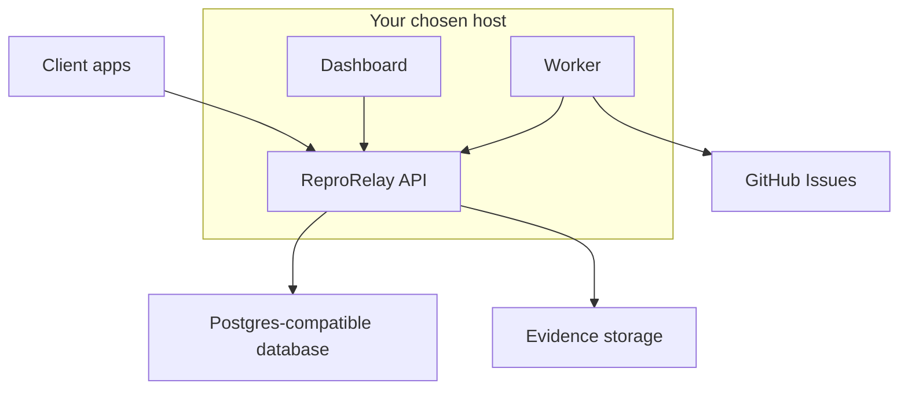

# Hosting Options

ReproRelay is meant to be open-source first, so hosting should be a choice, not a lock-in.

The system is split into portable parts:

- `apps/api` - a Node/Fastify HTTP API.
- `apps/worker` - a Node background worker.
- `apps/dashboard` - static React assets served by any static host or container.
- Postgres-compatible database - report/session metadata.
- Object storage - screenshots, replay blobs, and optional videos.



## Recommended Hosting Shapes

| Path | Best for | Compute | Metadata | Evidence storage |
| --- | --- | --- | --- | --- |
| Docker/self-host | Full control, on-prem, VPS | Docker Compose or Kubernetes | Postgres | MinIO or S3 |
| Railway | Simple hosted containers | Railway services | Railway Postgres | R2, S3, MinIO, or Vercel Blob |
| Vercel-first | Vercel teams, frontend-heavy stacks | Vercel Services/Functions | Neon or Supabase Postgres | Vercel Blob |
| Render/Fly.io/Northflank | Portable container hosting | Container services | Managed Postgres | S3-compatible storage |
| AWS/GCP/Azure | Enterprise/cloud-native teams | Containers or serverless | RDS/Cloud SQL/etc. | S3/GCS-compatible adapter or S3 |

## Required Building Blocks

### 1. Compute

You need somewhere to run:

- API service
- Worker service
- Dashboard/static site

The existing Dockerfiles support container hosts. Vercel-style/serverless hosts can use the same app boundaries, but may need host-specific routing or function wrappers.

### 2. Postgres

The API stores metadata in Postgres when `DATABASE_URL` is set. Compatible choices include:

- Railway Postgres
- Neon
- Supabase Postgres
- Render Postgres
- AWS RDS Postgres
- Self-hosted Postgres

If `DATABASE_URL` is missing, the API uses an empty in-memory store. It is useful for local development but is ephemeral and never seeds showcase reports. Production should set `DATABASE_URL` so reports survive restarts.

### 3. Evidence Storage

Evidence files are separate from report metadata. Choose one storage driver:

| Driver | Env | Good for |
| --- | --- | --- |
| Local filesystem | `STORAGE_DRIVER=local` | Local demos only |
| S3-compatible | `STORAGE_DRIVER=s3` | R2, S3, MinIO, Spaces, Wasabi, Backblaze B2 |
| Vercel Blob | `STORAGE_DRIVER=vercel-blob` | Vercel-first deployments |
| Auto | `STORAGE_DRIVER=auto` | Detects Vercel Blob first, then S3, then local |

See [storage-providers.md](storage-providers.md).

## Docker / Self-Hosted

Use the included Compose file:

```bash
cp .env.example .env
docker compose up
```

This starts Postgres, Redis, MinIO, API, and dashboard. The MinIO bucket is created automatically by the `minio-init` service.

Use this path for:

- Local demos
- VPS installs
- On-prem client deployments
- Teams that want every dependency self-hosted

## Railway

Use the three service configs in `railway/`:

- `/railway/api.railway.json`
- `/railway/worker.railway.json`
- `/railway/dashboard.railway.json`

Recommended Railway combo:

- Railway services for API, worker, dashboard.
- Railway Postgres for metadata.
- Cloudflare R2, AWS S3, or Vercel Blob for evidence.

See [railway.md](railway.md).

## Vercel-First

Recommended Vercel combo:

- One catch-all Node Function adapting `/v1/*` and `/health` into Fastify, with
  the built dashboard served as static CDN output.
- Neon or Supabase Postgres for metadata.
- Vercel Blob for screenshots, replay blobs, and videos.
- The protected `/v1/internal/worker` route for one-shot triage after report
  submission. A separate worker or queue can replace it at higher scale.

Use:

```bash
STORAGE_DRIVER=vercel-blob
VERCEL_BLOB_ACCESS=private
BLOB_READ_WRITE_TOKEN=<token>
DATABASE_URL=<postgres-url>
REPRORELAY_ADMIN_PASSWORD=<strong-password>
REPRORELAY_ADMIN_SESSION_SECRET=<random-secret>
REPRORELAY_INTERNAL_TOKEN=<different-random-secret>
```

Vercel Blob stores can also use Vercel OIDC with `BLOB_STORE_ID` when running on Vercel. The API adapter supports both token and OIDC-style configuration.

## Portable Container Hosts

For Render, Fly.io, Northflank, ECS, GCP Cloud Run, Azure Container Apps, or similar:

1. Deploy `apps/api/Dockerfile` as the API service.
2. Deploy `apps/worker/Dockerfile` as the worker service.
3. Deploy `apps/dashboard/Dockerfile` as the dashboard service, or host `apps/dashboard/dist` as static files.
4. Set `DATABASE_URL`.
5. Choose `STORAGE_DRIVER=s3` or `STORAGE_DRIVER=vercel-blob`.
6. Set `REPRORELAY_API_URL` to the public API origin.
7. Set `VITE_REPRORELAY_API_URL` on the dashboard build.

## Choosing A Default For Users

For the open-source repo, keep the default local story simple:

- Docker Compose
- Postgres
- MinIO
- Local dashboard

For production docs, present choices:

- "Most portable": Postgres + S3-compatible storage.
- "Vercel-native": Neon/Supabase Postgres + Vercel Blob.
- "Fastest hosted containers": Railway + Postgres + R2/S3/Vercel Blob.

That keeps ReproRelay independent while still making popular one-click-ish paths easy.
