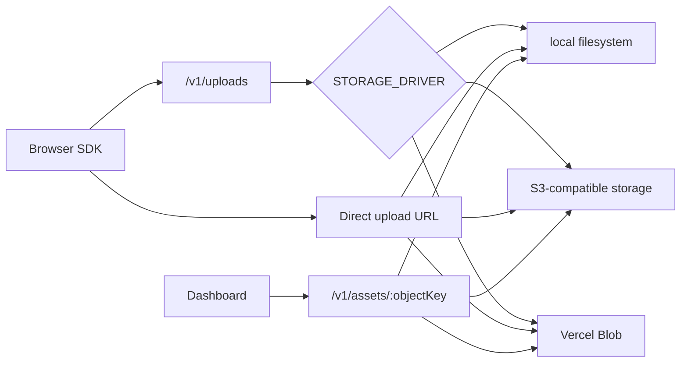

# Storage Providers

ReproRelay stores two different kinds of data:

- Metadata in Postgres: reports, sessions, status, GitHub issue links, agent state.
- Evidence in object storage: screenshots, rrweb replay JSON, optional videos.

The API chooses evidence storage with `STORAGE_DRIVER`.



## Driver Selection

| Driver | Behavior |
| --- | --- |
| `auto` | Uses Vercel Blob if Blob env is present, then S3 if `S3_BUCKET` is present, otherwise local |
| `local` | Stores files under `storage/`; development only |
| `s3` | Uses presigned S3-compatible PUT URLs |
| `vercel-blob` | Uses Vercel Blob signed PUT URLs |

## Local Filesystem

Use only for local development:

```bash
STORAGE_DRIVER=local
REPRORELAY_API_URL=http://localhost:4000
```

Files are written to `storage/` under the API process directory. Do not use this on ephemeral hosts such as Railway or serverless platforms.

## S3-Compatible Storage

Works with:

- Cloudflare R2
- AWS S3
- MinIO
- DigitalOcean Spaces
- Wasabi
- Backblaze B2 S3-compatible API

```bash
STORAGE_DRIVER=s3
S3_BUCKET=reprorelay
S3_REGION=auto
S3_ENDPOINT=https://<endpoint>
S3_ACCESS_KEY_ID=<access-key-id>
S3_SECRET_ACCESS_KEY=<secret-access-key>
S3_FORCE_PATH_STYLE=true
S3_PUBLIC_URL=
```

Leave `S3_PUBLIC_URL` blank for private buckets. The dashboard will read assets through the API proxy at `/v1/assets/:objectKey`.

Set `S3_PUBLIC_URL` only when the bucket is intentionally public or fronted by a private CDN/auth layer you control.

For AWS S3 specifically, you can usually omit `S3_ENDPOINT` and leave `S3_FORCE_PATH_STYLE` unset.

## Vercel Blob

Vercel Blob is useful for Vercel-first deployments and supports private stores plus signed upload URLs.

```bash
STORAGE_DRIVER=vercel-blob
VERCEL_BLOB_ACCESS=private
BLOB_READ_WRITE_TOKEN=<blob-read-write-token>
VERCEL_BLOB_UPLOAD_TTL_SECONDS=300
VERCEL_BLOB_MAX_UPLOAD_BYTES=209715200
VERCEL_BLOB_CACHE_CONTROL_MAX_AGE=2592000
```

When running on Vercel with OIDC connected to a Blob store, you can use:

```bash
STORAGE_DRIVER=vercel-blob
VERCEL_BLOB_ACCESS=private
BLOB_STORE_ID=<blob-store-id>
```

The Vercel runtime provides `VERCEL_OIDC_TOKEN`; locally or outside Vercel, use `BLOB_READ_WRITE_TOKEN`.

## Read Access

The SDK stores evidence URLs as `/v1/assets/:objectKey` by default. That means:

- Private buckets/stores can stay private.
- The dashboard has one consistent evidence URL shape.
- Later authentication can be enforced in the API before serving evidence.

For public S3-compatible buckets, `S3_PUBLIC_URL` can bypass the API for direct asset delivery.

## Upload Limits

The browser SDK requests a signed upload URL from `/v1/uploads`. Storage providers then enforce upload constraints:

- S3-compatible: presigned PUT expires after 5 minutes.
- Vercel Blob: signed PUT expires after `VERCEL_BLOB_UPLOAD_TTL_SECONDS`.
- Vercel Blob rejects uploads larger than `VERCEL_BLOB_MAX_UPLOAD_BYTES`.

Keep video capture short by default. The current SDK records 10 seconds when users opt into screen video.
